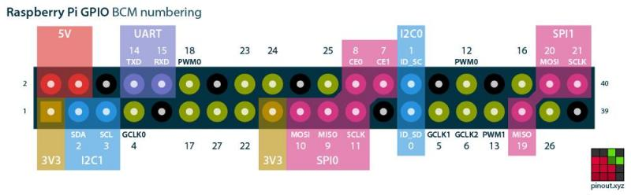
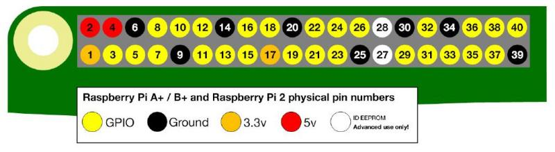
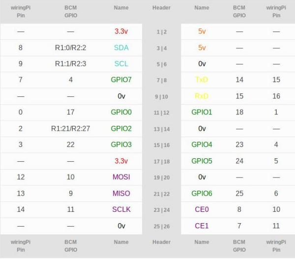
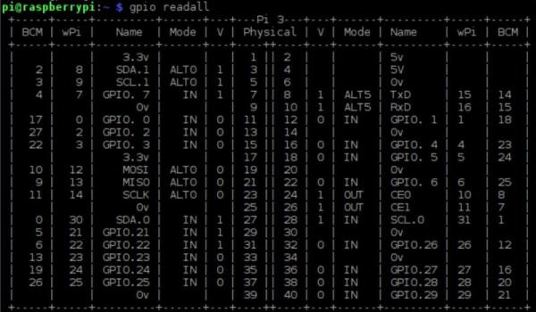

====
GPIO
====

Qualsiasi esperienza che si vuole effettuare collegando un raspberry ad uno o più sensori non può prescindere dalla conoscenza dell'interfaccia
hardware predefinita per l'input/output: il **General Purpose Input Output, GPIO**.

Tanto per essere sicuri che ci capiamo, quello fatto come in figura...

    
Prendete anche un RPI in mano e guardate bene per capire: il GPIO non è altro che la sequenza di PIN, di cui molti funzionano sia per l'input delle informazioni
che per l'output delle stesse, a cui è possibile collegare praticamente ogni sorta di sensore, analogico o digitale, adatto più o meno a qualunque scopo.
Da tutto questo ragionamento si spiega anche la scelta del nome: General Purpose Input Output.

Per gestire questi pin, bisogna prima riconoscerli... e qui nascono le prime difficoltà! Infatti, a seconda dell'interfaccia utilizzata per gestirli abbiamo 3 diversi
modi per numerarli:

#. GPIO numbering
#. Physical numbering
#. WiringPi numbering

GPIO numbering
==============

Questo sistema di numerazione dei pin è stato stabilito dal produttore dell'interfaccia hardware, ovvero dei pin stessi e del chipset che li controlla.
Per chi è interessato alla cosa, il controller è un Broadcom BCM2835/BCM2836/BCM2837 :)

Inutile spiegare tanto a parole quando si può semplicemente guardare un'immagine e dire *vabbè...*

Physical numbering
==================

Un altro modo di contare i pin è quello di numerarli a due a due a partire da in alto a sinistra (il numero 1 è il pin più vicino allo slot della scheda MicroSD)

Anche qui, con un'immagine è più semplice:

WiringPi numbering
==================

Ultimo metodo per "contare" i pin è quello basato sulla libreria *WiringPi*. 
L'immagine che segue è presa dal sito WiringPi e confronta i tre metodi di numerazione dei pin

Un metodo ulteriore per controllare i numeri dei pin del raspberry è quello di interrogare direttamente il gpio tramite un piccolo applicativo contenuto nelle librerie
WiringPi.

.. code-block:: bash

    $ gpio readall

L'output di questo comando dovrebbe essere una cosa del genere:

Leggendo attentamente lo schema riportato possiamo desumere tutte le informazioni necessarie :)

